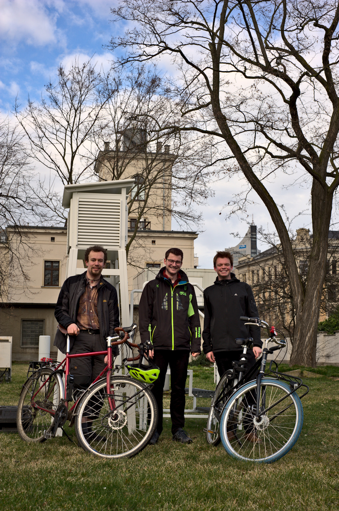

{:class="img-responsive"}

Wir sind Jakob, Johannes und Oscar (v.l.n.r) und kennen uns aus dem Meteorologie Studium am Leipziger Institut für Meteorologie. Zum Projektstart im Jahre 2022 waren Jakob und Oscar noch im Masterstudium, während Johannes schon seine Promotion am Insitut für Meteorologie begonnen hatte.  Nach Abschluss des Projektes im Oktober 2022 wechselte auch Oscar in eine Promotionstelle am Leibniz-Institut für Troposphärenforschung (TROPOS) in Leipzig. 
